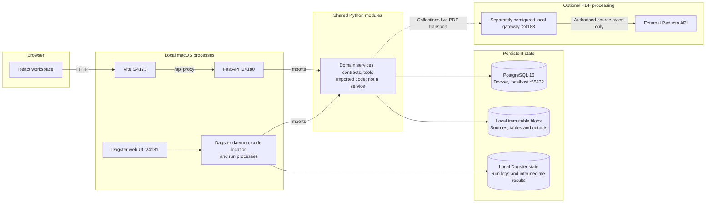

# Implemented system architecture

This is the canonical map of the implemented CloseGraph system. It follows the imports and process commands in [runtime.py](apps/api/src/closegraph/runtime.py), [the Dagster definitions](apps/api/src/closegraph/pipeline/definitions.py), [App.tsx](apps/web/src/App.tsx) and [the local supervisor](scripts/local_runtime.py). The [product brief](docs/product-brief.md) explains the original problem; the [roadmap](docs/roadmap.md) distinguishes the archived reporting-pack scope from subsequent Collections work.

## Responsibilities and runtime

CloseGraph preserves uploaded evidence, runs explicitly scoped checks, records corrections and helps an independent reviewer inspect the exact version being approved. It supports fund reporting review; it does not calculate arbitrary NAV or fees, infer accounting treatment, certify financial correctness or post accounting entries.

The current full stack is local on macOS. React runs in the browser; Vite, FastAPI and Dagster run as local processes under the runtime's Seatbelt policy. Only PostgreSQL runs in Docker. The shared-code box below is **imported Python code, not a service**: each Python process constructs its own service objects, using the same database and scoped file stores.

There is no direct API-to-Dagster submission service. Domain services persist processing requests in PostgreSQL. Dagster sensors find pending requests, claim bounded work and persist results through those same services. Review and publication happen after computation finishes; no running job waits for a person. Dagster's web UI is an engineering diagnostic surface, not the product review workspace.

## Two domain paths

| Path | Implemented behaviour | Runtime wiring |
| --- | --- | --- |
| Reporting packs | Declared CSV/XLSX layouts, contextual facts, the fictional authorised fee rule, explicit dependencies, correction/reconciliation, one value-only workbook template and review manifest. PDF observations retain source citations; unsupported mappings block release. | `/api/packs` → `PostgreSQLPackServices` → `process_reporting_pack`. `services/native.py` imports `extraction/` and validators. |
| Collections and guided fund review | Varied source tables, document revisions, accepted extraction versions, versioned recipes, required checks, source-linked differences, bounded requests/owners/deadlines, explicitly shared evidence, independent output review and HTML working briefs. | `/api/collections` → `CollectionServices` with collaboration, reconciliation and fund-review mixins → `process_collection`. The current `App.tsx` opens `FundReviewWorkspace` after login. |

These paths share authentication, PostgreSQL infrastructure, blob-store primitives and the Dagster code location. They have separate state models, request records, jobs and blob roots; Collections is not an alias for a reporting pack. The existing `features/packs/` review components remain in the repository and Storybook, but the current application entrypoint opens the guided Collections-backed fund-review journey.

The archived OpenSpec change and five baseline specs describe the accepted reporting-pack MVP. Its proposed phase 2 remains unopened. Bounded in-app Collections requests, owners, deadlines and deduplicated escalation were implemented outside that OpenSpec phase. External delivery, reminders through external providers and live source connectors remain deferred.

## Code map

Paths below the API package are relative to `apps/api/src/closegraph/`.

| Location | Responsibility |
| --- | --- |
| [apps/web/src/main.tsx](apps/web/src/main.tsx), [App.tsx](apps/web/src/App.tsx) | React mount, server-session login and guided fund review. `features/fund-review/`, `features/collections/` and `features/reconciliation/` contain the related screens and API clients. |
| [apps/web/src/features/packs/](apps/web/src/features/packs/), [components/](apps/web/src/components/) | Reporting-pack review, original source/PDF viewing, shared controls and processing animation. |
| [apps/web/.storybook/](apps/web/.storybook/), [lib/synthetic.ts](apps/web/src/lib/synthetic.ts) | Component catalogue and labelled fictional reporting-pack workflows. Story actions change browser-local example state; they do not authenticate users or publish files. |
| [runtime.py](apps/api/src/closegraph/runtime.py) | Builds local accounts, pack and collection services, provider adapters and blob roots. API startup applies Alembic migrations, migrates business-account names and seeds absent synthetic packs. |
| [api/](apps/api/src/closegraph/api/) | FastAPI routes, session/CSRF checks, scoped authority and transactional reporting-pack operations. `app.py` also mounts the Collections router. |
| [contracts/](apps/api/src/closegraph/contracts/), [services/](apps/api/src/closegraph/services/) | Typed evidence/facts/actions, version validity, corrections, dependency impact, routing, review, publication and supported native evaluation. |
| [extraction/](apps/api/src/closegraph/extraction/), [extractors/](apps/api/src/closegraph/extractors/), [normalisers/](apps/api/src/closegraph/normalisers/) | Native parsing and contextual normalisation. The wired reporting-pack evaluator uses `extraction/`; Collections uses its own `collections/extract.py`. Native `extractors/` and `normalisers/` modules re-export the `extraction/` implementations under the specification namespaces. `extractors/reducto.py` supplies PDF transport/decoding primitives used by the PDF paths. |
| [validators/](apps/api/src/closegraph/validators/), [outputs/](apps/api/src/closegraph/outputs/) | Schema/coverage and financial checks, mapped workbook generation and manifests. Polars/Pandera validate data; openpyxl reads/writes supported workbooks; monetary calculations use Decimal. |
| [collections/](apps/api/src/closegraph/collections/) | Collection routes/models, extraction, recipes/transformation, reconciliation, evidence sharing, requests/deadlines, fund-review checks and export gates. `service.py` composes the domain mixins. |
| [pipeline/](apps/api/src/closegraph/pipeline/), [collections/pipeline.py](apps/api/src/closegraph/collections/pipeline.py) | Dagster assets, sensors, run ownership/retries and result persistence for the two jobs. The Collections sensor also sweeps in-app deadlines. |
| [storage/](apps/api/src/closegraph/storage/), [apps/api/alembic/](apps/api/alembic/) | SQLAlchemy/PostgreSQL persistence, Alembic schema history and immutable local blob storage. |
| [scripts/](scripts/), [compose.yaml](compose.yaml) | Local demo launcher, service supervisor, optional reviewed PDF gateway and PostgreSQL container configuration. |
| [automation/](automation/) | Engineering tooling: sandbox, runner, issue/PR coordination and historical paused cron drafts. It is not a financial agent, product service or Dagster replacement. Current engineering policy is in [standing authorization](docs/engineering/standing-authorization.md) and [the runner guide](docs/engineering/codex-runner.md). |

## Entrypoints and persistent state

- `npm run demo` invokes `scripts/demo.mjs`, which prepares dependencies and calls `scripts/local_runtime.py`. See [local runtime setup](docs/engineering/local-runtime.md) for prerequisites and lifecycle commands.
- The API starts as `python -m uvicorn closegraph.runtime:app_factory --factory --host 127.0.0.1 --port 24180`. The factory requires local credentials and `CLOSEGRAPH_DATABASE_URL`; it is not a production identity provider.
- Dagster loads `closegraph.pipeline.location` through a gRPC code location on `127.0.0.1:24182`. A daemon and webserver use the generated `workspace.yaml`; `build_definitions` registers `process_reporting_pack` and `process_collection` with in-process asset execution inside each run.
- Vite serves the current application at `127.0.0.1:24173` and proxies `/api` to FastAPI. The separate `npm --prefix apps/web run storybook` command serves synthetic UI examples at `127.0.0.1:24174`; it is not started by the full-stack supervisor.
- The default supervisor state directory is `.local/dev-runtime/`: private account/configuration values in `.env`, source/output stores under `data/blobs` and `data/collection-blobs`, intermediate JSON under `data/dagster-io`, and local Dagster instance state/logs under `dagster/`. PostgreSQL data lives in the Compose named volume. Restarting preserves saved work; this is not a managed backup or disaster-recovery service.

## Trust boundaries

The browser submits intent and displays server results. Server-resolved identity and resource scope govern evidence reads, mutation, sharing, review and release. A story role, imported document, parser response or client-supplied pass flag cannot grant authority. Assignment does not grant document access; external-party accounts require explicit scoped sharing.

Original bytes, raw identifiers, source locators and prior versions remain evidence. Checks, parser observations, execution success, review decisions and freshness are separate. Hard blockers override confidence; failed or unknown required checks prevent release. Corrections create new versions, and independent approval is tied to the exact current checked scope and output bytes.

Native CSV/XLSX processing needs no model/provider calls. Collections supports explicitly disabled, captured replay and configured live PDF transport. Its separate [gateway](scripts/reducto_gateway.py) requires credentials, an authorised source-hash allowlist and a data-handling record before external Reducto processing. It is not automatically launched by `npm run demo`. The reporting-pack environment factory configures disabled/replay modes but does not wire that gateway: its live mode requires an explicitly injected transport and otherwise reports unavailable. Unavailable providers remain unavailable, and replay is not live evidence. Docling is an optional evaluated second pass, not an installed runtime service.

## CI and deployment limits

[CI](.github/workflows/ci.yml) checks specs, non-live API tests with PostgreSQL and critical Ruff rules, web unit/build checks plus only the `stories` and `batman` browser projects, and macOS engineering/runtime-launcher tests. The [README verification section](README.md#verification) lists the exact job scope. CI does not run the full-stack browser acceptance journeys, use private datasets or establish live-provider acceptance.

[vercel.json](vercel.json) builds only `apps/web` Storybook and serves `apps/web/storybook-static` as a labelled **synthetic UI/workflow demo**. Use the repository root as the Vercel project root and Node 24. There are no backend functions, API rewrites or hosted accounts in this target. FastAPI, PostgreSQL, Dagster and local-file persistence remain local; the complete product demo is still `npm run demo` on macOS. The [upload allowlist](.vercelignore) retains Storybook source/configuration and its synthetic cited-page PDF while excluding backend, engineering, private/runtime and generated evidence material. See Vercel's [build configuration](https://vercel.com/docs/project-configuration/vercel-json) and [CLI upload exclusions](https://vercel.com/docs/deployments/vercel-ignore).

Production hosting, production identity management, managed storage/backups, external notifications/connectors and accounting writes require separately scoped work. A successful static build or synthetic interaction does not establish production readiness or financial approval.
