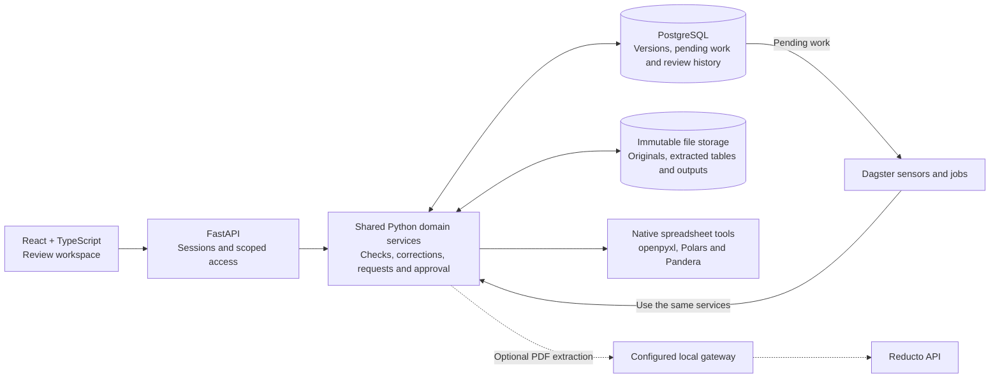

# CloseGraph

CloseGraph helps private-market fund teams review reporting workbooks and resolve missing information. It connects a failed check to the source records, the person responsible and the history of the correction.

The idea came from interviews with fund managers, accountants and account managers: the same figures get checked repeatedly, while questions about missing evidence pass between teams. CloseGraph keeps that work in one place.

**[Watch the demo](https://drive.google.com/file/d/1PqvqqFrLSXyXixYrqbaN-kVW5u1vsAiP/view?usp=sharing)** · 4 minutes 53 seconds

## Try it locally

You’ll need **macOS**, **Docker Desktop** running, **uv**, **Python 3.12** and **Node.js 20.19+**.

```sh
npm run demo
```

This installs dependencies and starts the application. Open **http://127.0.0.1:24173**. To see the passwords generated for your local accounts:

```sh
npm run demo:accounts
```

| Account | Role |
| --- | --- |
| `accountant` | Upload workbooks, check records, request evidence and make corrections. |
| `account_manager` | Coordinate requests, review changes and independently approve completed work. |
| `fund_manager` | Supply evidence and respond to assigned fund-level questions. |
| `investor` | Respond to requests explicitly shared by the account manager. |

Start with the accountant account. Fund managers and investors see work only after it has been shared with them. Passwords are generated separately for each installation.

See [local setup and troubleshooting](docs/engineering/local-runtime.md) for service controls and PDF configuration.

## What to upload

Start with an **XLSX workbook or CSV containing financial activity**, alongside a **reference workbook or CSV** that describes how that activity should be classified. Useful combinations include:

- An investor-level general ledger and an entity or investor reference list.
- A movement schedule and its account or reporting-code mappings.
- Two schedules containing totals that should agree for the same entities, periods and currencies.

Choose files with a question you want to answer: is an entity missing from the reference list, is a required value blank, is a key duplicated, or do the selected totals agree? Multi-sheet workbooks are supported; confirm the relevant tables, headers and columns before running a check. PDF processing requires a separately configured extraction provider.

### A first review

1. Open **New review**, upload your files and select **Prepare review brief**.
2. Add a check, inspect the table previews and confirm the columns to compare.
3. Open a finding to see the affected records and their original workbook locations.
4. Request missing evidence or submit a correction with a reason. Rerun the checks to see whether it resolves the finding.
5. Inspect **History** and download a working brief. An account manager can independently approve the completed scope.

A reply or attachment keeps the conversation moving; the underlying check still needs to pass. Working downloads keep unresolved findings visible.

## Architecture



**The browser is the review workspace.** FastAPI checks identity and access for each action. PostgreSQL holds document versions, checks, requests and decisions; immutable file storage preserves the uploaded evidence and generated outputs.

**Dagster runs the processing.** Services save pending work in PostgreSQL, then Dagster sensors pick it up and execute extraction and checks. The API and jobs use the same Python domain modules. Jobs finish before a person reviews the results, so processing does not wait on someone replying or approving.

**Extraction and checking are separate.** Native CSV/XLSX processing uses spreadsheet libraries, with decimal arithmetic for monetary checks. Users choose mappings and check scope. PDF extraction can use Reducto, whose output still needs review. Corrections retain the original values, and approval belongs to the exact reviewed version.

The current app uses the Collections-backed fund-review workflow. The repository also retains an earlier reporting-pack workflow with its own state and jobs. See [the detailed architecture](ARCHITECTURE.md) for the code map and runtime boundaries.

## Refining the data pipeline

The next work is to make a wider range of messy files easier to review:

- **Better table interpretation.** Handle repeated headers, mixed date formats and disconnected tables more consistently, with a preview whenever an interpretation changes the result.
- **Clearer extraction coverage.** Show which sheets, ranges and formula results could be checked, and what still needs attention. Preserve supporting content alongside the main tables.
- **Faster revision processing.** Reduce repeated parsing and comparison on large workbooks, reusing unchanged results only when their dependencies are known.
- **Reusable review setups.** Let teams carry confirmed mappings and checks into the next reporting period, with confirmation when the source layout changes.
- **Broader accuracy evaluation.** Expand independently checked cases using varied real layouts and deliberate mutations: duplicated or missing rows, changed currencies, stale formula results and offsetting errors that leave totals unchanged.

These are development priorities. The current product provides evidence-backed reporting checks; it does not independently certify NAV, fees or final accounts. Accounting treatment remains explicit, and Excel recalculation is outside the current pipeline.

## Verification

[GitHub Actions](.github/workflows/ci.yml) checks the API against PostgreSQL, the web tests and builds, selected browser flows and the macOS runtime tooling. [Workflow acceptance records](docs/verification/fund-review-acceptance.md) cover the separate workbook rehearsals and their limits.

The full application currently runs locally. The included deployment configuration serves a synthetic Storybook demo; production hosting and identity management are future work. Dataset files and local credentials are not included in the repository.
