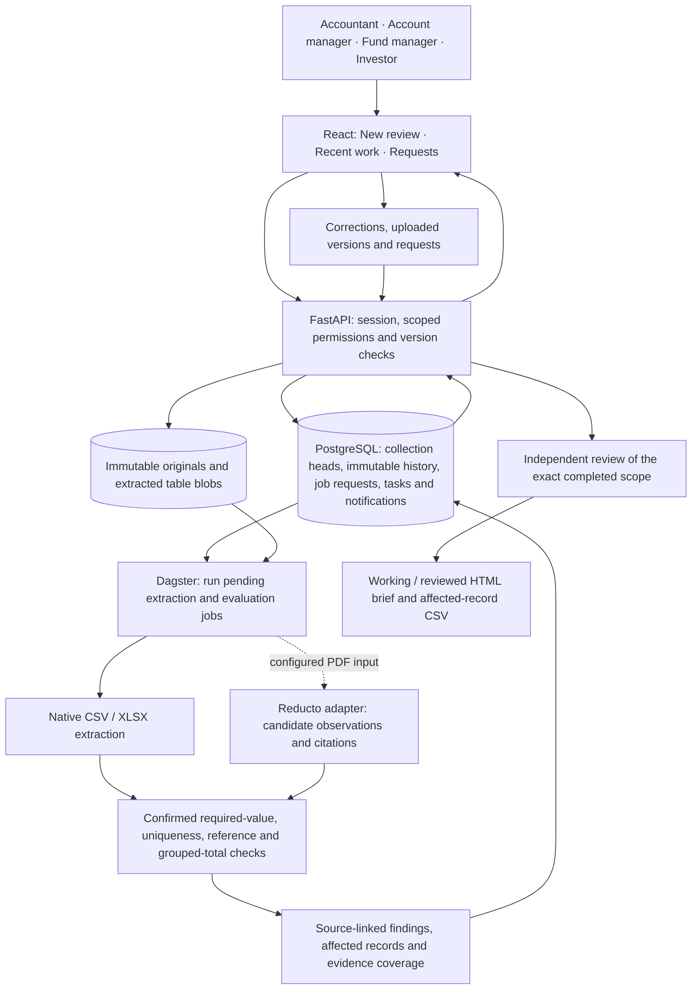

# Current product architecture

The local POC is a React/TypeScript interface over FastAPI, PostgreSQL, immutable local files and Dagster. It accepts uploaded versions, not live spreadsheet edits. Native workbook extraction and selected checks do not call an LLM.

## Trust and responsibility

- Authentication resolves one of four separately provisioned local accounts. Document/request permissions are enforced in services; hiding a button is not the access boundary.
- Originals are retained with immutable revision history. An extracted correction creates a recorded decision; it does not overwrite the uploaded workbook.
- Table/header/column proposals need explicit confirmation of meaning and scope. Missing or ambiguous input is not a passing check. The source, selected rule and result versions remain linked.
- Check results explain expected versus observed values. A passing selected check does not establish correctness of the entire pack.
- Assignment, responses, evidence and decisions are recorded. Evidence receipt alone cannot resolve a system discrepancy. Investor-facing requests require account-manager release and scoped access.
- Approval is independent and version-bound. Source or rule changes invalidate affected approval; historical decisions remain available.
- PDF observations may come from a live configured provider or an explicitly labelled captured replay. The XLSX judge demo needs neither. This diagram does not imply every parser observation is correct.

## Code to inspect

| Concern | Location |
| --- | --- |
| Guided screens and check selection | `apps/web/src/features/fund-review/` |
| Authentication and HTTP contracts | `apps/api/src/closegraph/api/` |
| Collection versions and document operations | `apps/api/src/closegraph/collections/service.py`, `documents.py` |
| Fund-review checks and decisions | `apps/api/src/closegraph/collections/fund_review.py`, `fund_review_service.py` |
| Requests, permission projection and notifications | `apps/api/src/closegraph/collections/collaboration.py`, `workflow.py` |
| Computational execution | `apps/api/src/closegraph/pipeline/` |
| Real-file browser rehearsal | `apps/web/tests/fund-review.spec.ts` (private input manifest supplied separately) |
| Observed acceptance and limits | [Fund-review acceptance](verification/fund-review-acceptance.md) |

The historical engineering automation architecture is separate from this application. Production authentication, hosting, live source connectors and general-purpose accounting policy are outside the local POC.
